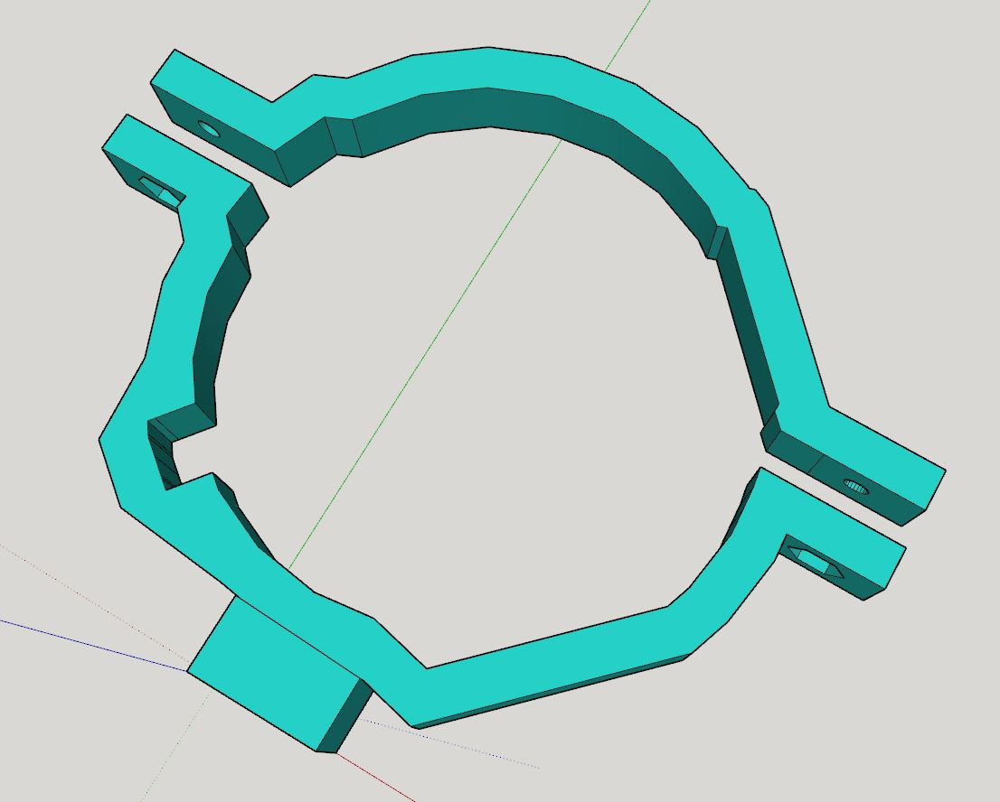
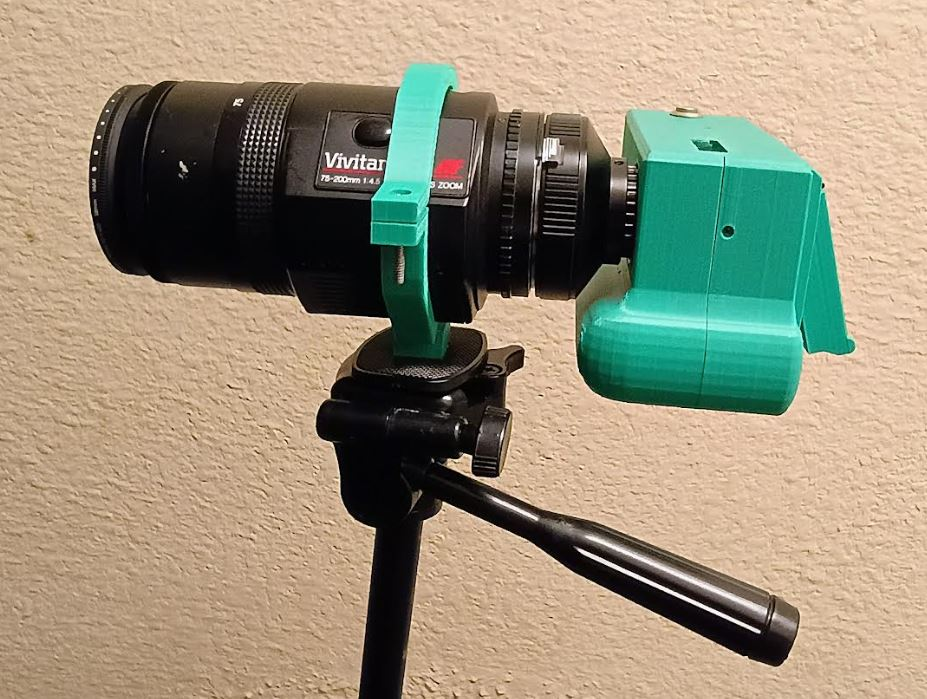
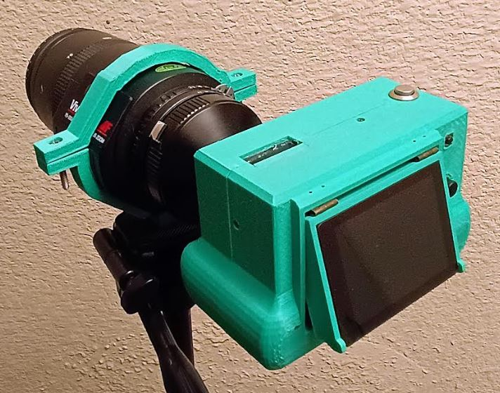

### About

This is a very basic clamp using two bolts and a 4-20 nut for the tripod.

See the completed part below.

Note: when I printed mine the outer bolt nuts holes were a bit loose, I updated the design and reduced the width but yeah keep that in mind.

The bolts/nuts are 6-32x1 size, although 1" I think is too long if you can get it shorter like half an inch that would be better.

You can see in the pic above how the bolts stick far out.

Also you need to let the superglue cure overnight/a long time since it's a lot of weight.
