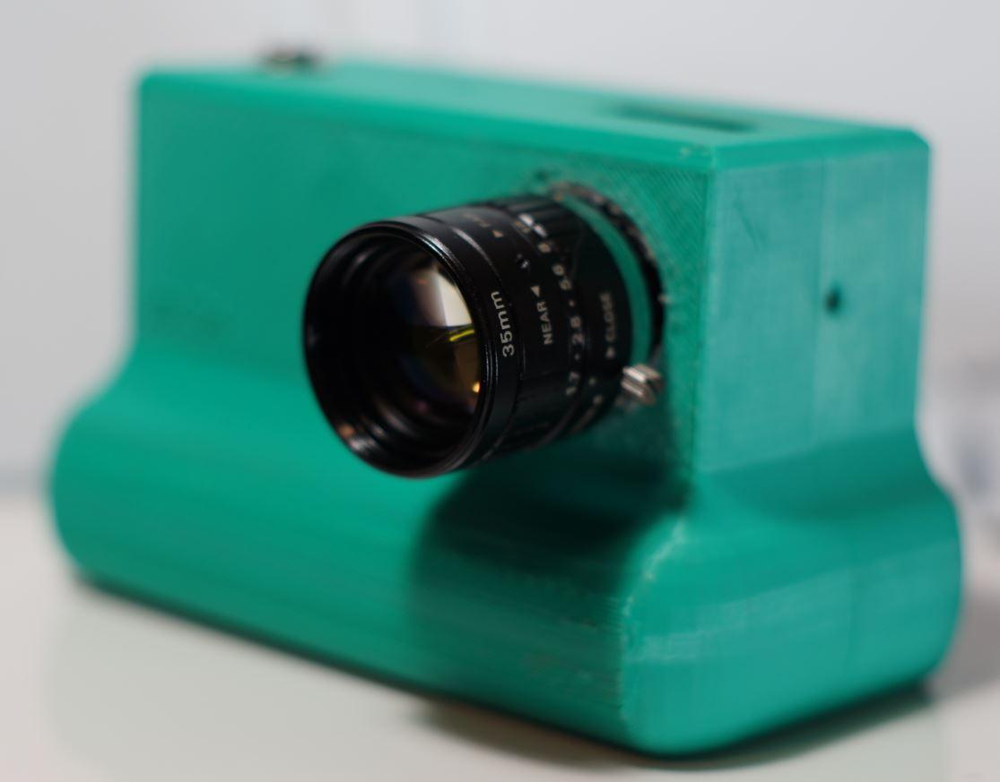

# Arducam 35mm C-mount CCTV lens

# Impressions

It's been a while since I used this lens, I think it was sharp but had this purple tint problem when looking near the sun.

# Flange adjustment required?

# Pro

# Cons

# Sample images

- normal and macro

# Outings

- descending date, sample pic, notes
