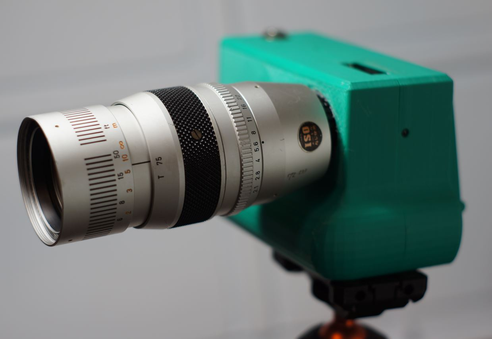
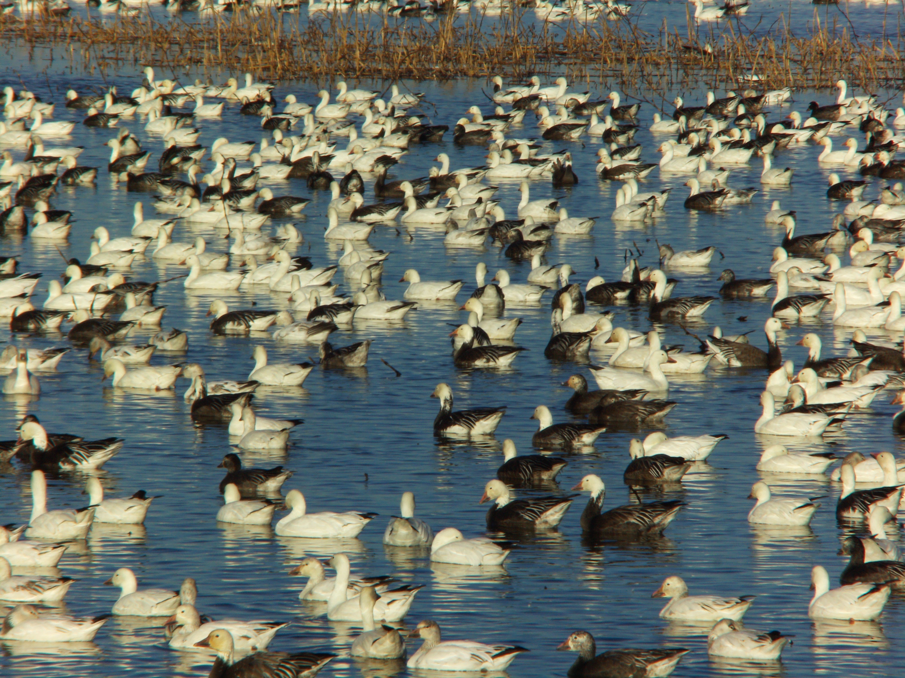

# Canon TV Zoom J5x15 15-75mm f2.1 Cine Lens C Mount

# Impressions

[Close up video of lens](https://www.youtube.com/watch?v=ln1OabHzOTM)

I have not taken this lens out on its own yet. But I have taken it out a couple times.

It appears to be sharp though and the focus ring works great. Good depth of field too.

# Flange adjustment required?

Yes

# Pro

Pretty lens

# Cons

This one that I have has haze, yellow-ish tint which I'm not sure if the yellow tint is normal or not

But this is also why I got this lens at a decent price is because of the haze

# Sample images

- normal and macro

# Outings

## Feb 2026

This was a fun day, hundreds of thousands of birds

[Video](https://www.youtube.com/watch?v=1GjfKuYk2jw)
