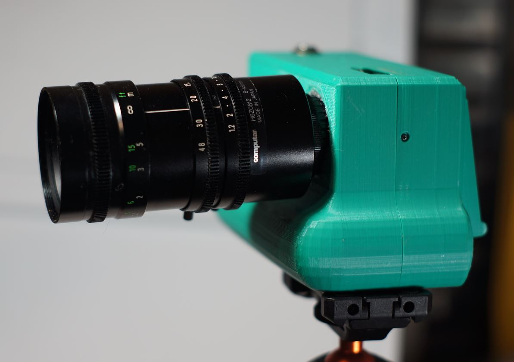
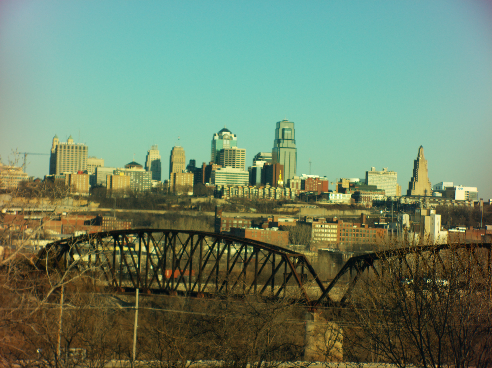
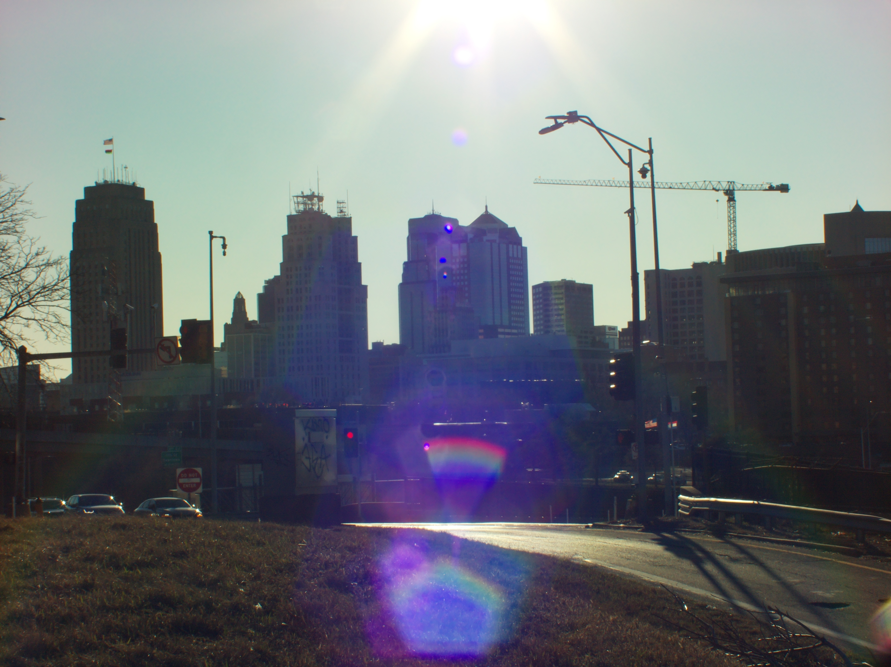

# Computar H6Z0812 8~48MM 1.2 zoom CCTV Lens 

# Impressions

[Close up video of lens](https://www.youtube.com/watch?v=9-srmYwyEX8)

This lens like the name suggests is like a huge CCTV camera lens where it has those little nubs/dials you turn to stop the rings from spinning.

It's also greasy, at least this one that I have so I don't like that.

The lens seems sharp. Has purple tint if looking into the sun.

Need to use it more.

# Flange adjustment required?

Yes

# Pro

Cool rainbow flare

# Cons

Harder to focus near widest focal length

# Sample images

I pulled over on the highway to take this pic, I was nervous so I didn't do a good job but I like the lighting.

# Outings

## Feb 2026

I was scared to be out at the outskirts of the city at the time I took this lens out. That's more on me though than the city, I feel anxiety being in a grocery store for example (crowds).

[Video](https://www.youtube.com/watch?v=N7-w1U-3ddg)
