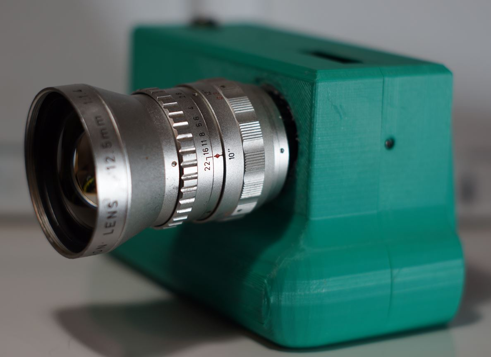
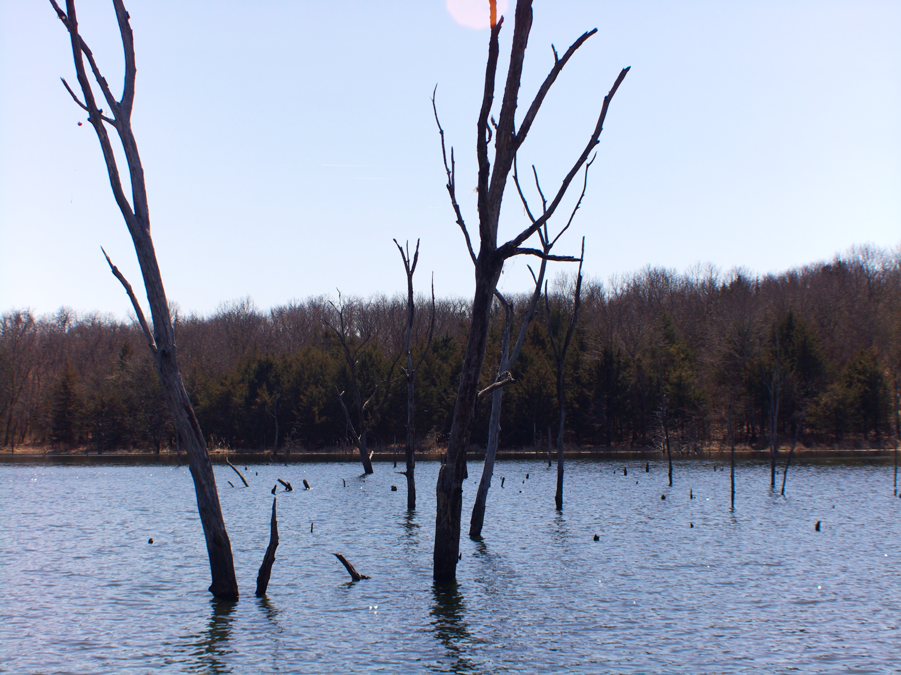
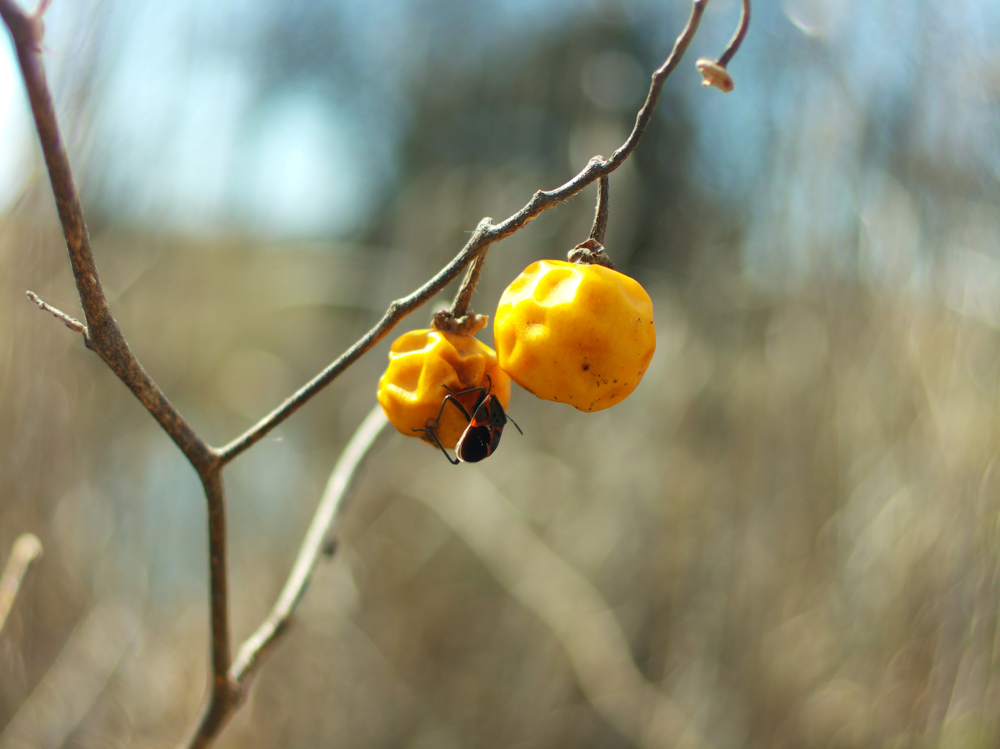
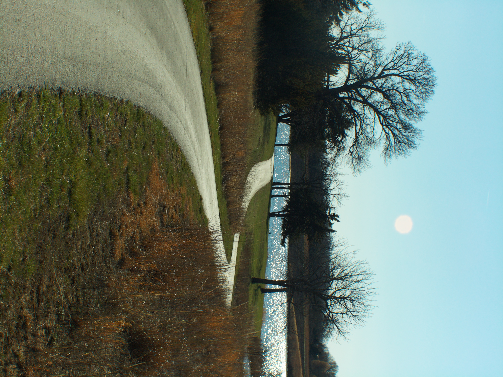

# Cosmicar Television Lens 12.5mm 1:1.4 No. 86481

# Impressions

I don't have any immediate thoughts, it seems like a pretty good lens. Definitely better than the rainbows.

I need to use it more. Most of these lenses I took out in early spring when the vegetation is pretty boring/no leaves.

# Flange adjustment required?

Yes

# Pro

# Cons

# Sample images

# Outings

## Mar 2026

[Video](https://www.youtube.com/watch?v=QXmjm_u0AMw)
