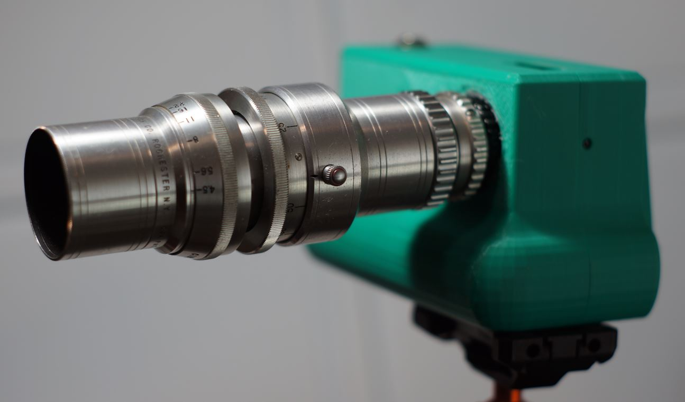
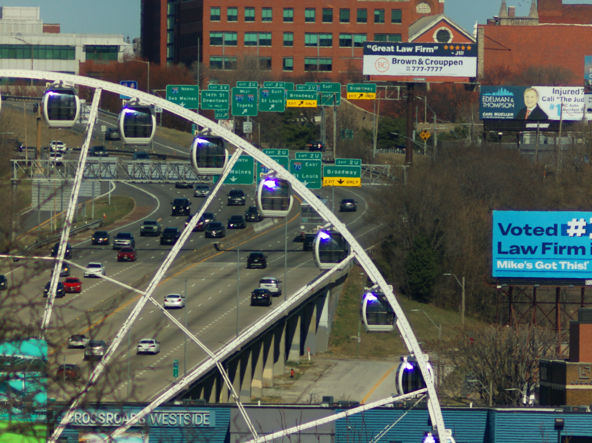
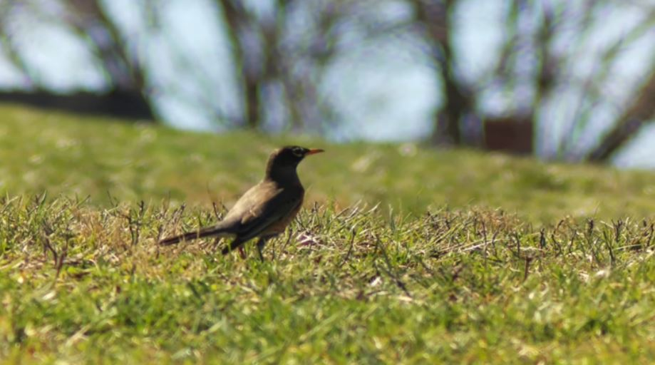

# SUPER-16 KODAK 152MM C-MOUNT LENS for BOLEX 16MM MOVIE CAMERA

# Impressions

[Close up video of lens](https://www.youtube.com/watch?v=QOC4Dqv4Cu4)

This is a really neat lens... it's shaped so oddly like it's a lightsaber. It is very sharp which is crazy. I had a really fun time using it, the zoom is crazy... because on the HQ cam with the 5.5 crop factor this lens is around 800mm.

But it was fun filming birds on grass and seeing the haze in the sky on really far away shots.

# Flange adjustment required?

Yes

# Pro

Very sharp

# Cons

With the crop factor of the HQ cam this is for very far away shots.

Also the vibration since there is no ibis on this camera/sensor it's brutal, even wind will make the footage shaky.

# Sample images

I was around 0.4 miles away form the Ferris wheel

# Outings

## Mar 2026

[Video](https://www.youtube.com/watch?v=kJCApRBXa9o)
