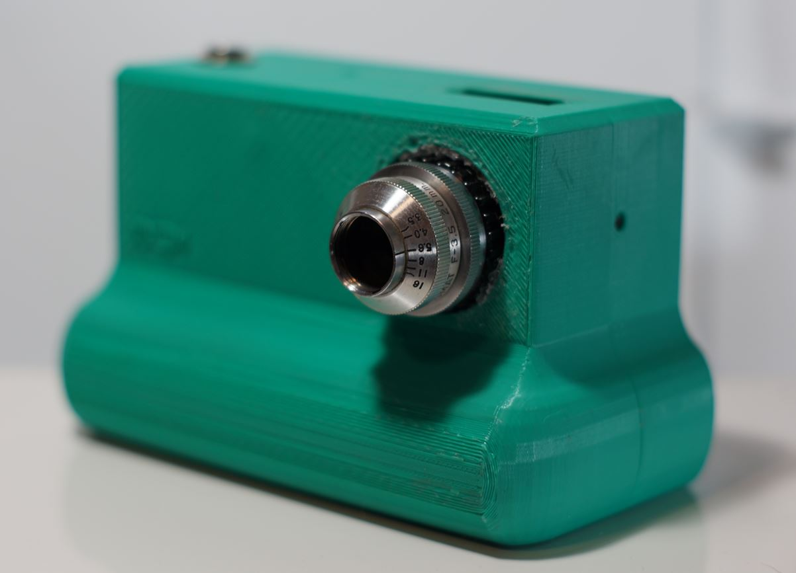
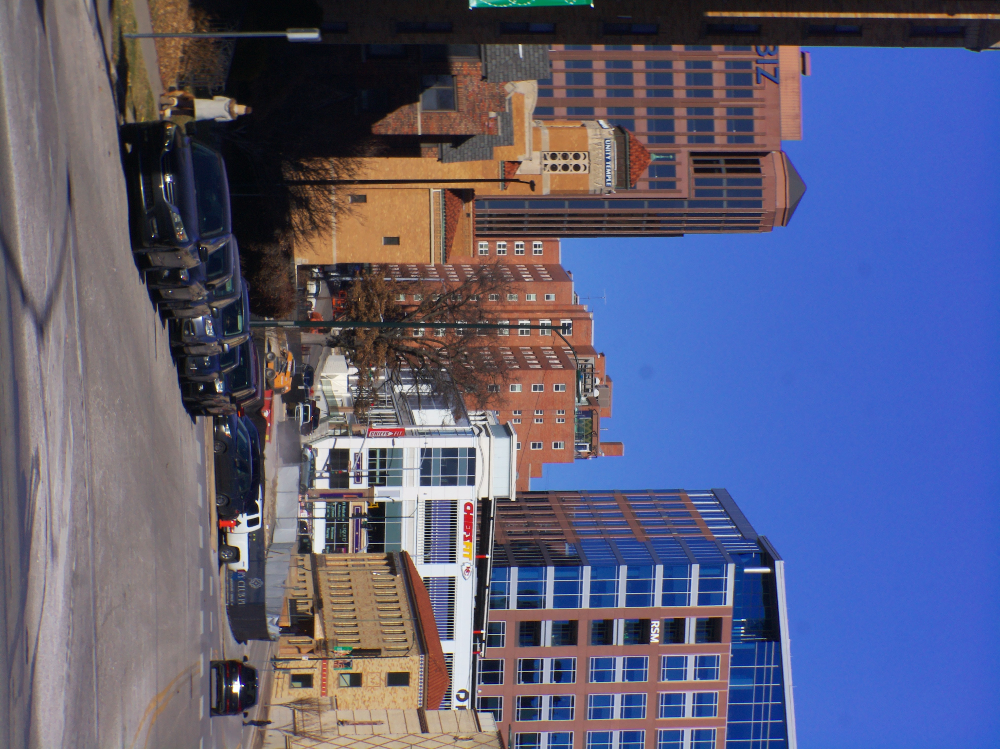
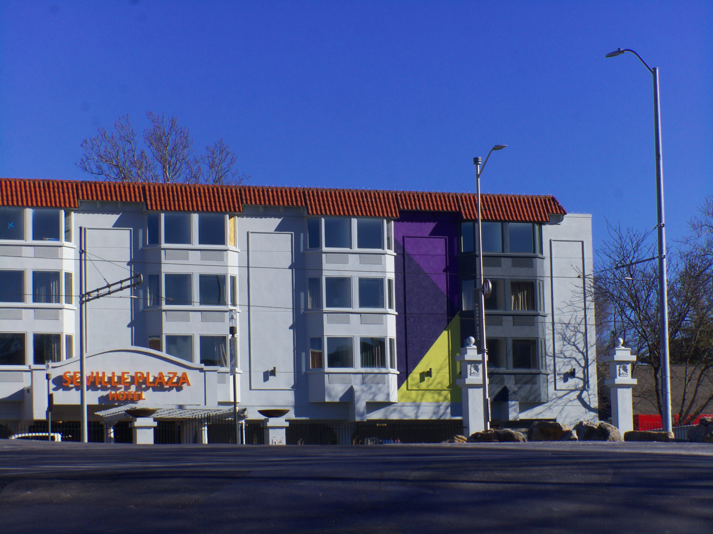

# Kodak Anastigmat 20mm f/3.5 Cine Lens – Vintage 16mm – C-Mount

# Impressions

[Close up video of lens](https://www.youtube.com/watch?v=KrAkFn1HXJg)

I don't have much of an impression on this lens yet. I have only used it on the modular pi cam which has half the quality display of JDC34 camera.

Its quality reminds me of the Revere-Scienar 25mm which is pretty good

# Flange adjustment required?

Yes

# Pro

# Cons

# Sample images

# Outings

## Jan 2026

[video](https://www.youtube.com/watch?v=PsK5v4bTYqQ)
