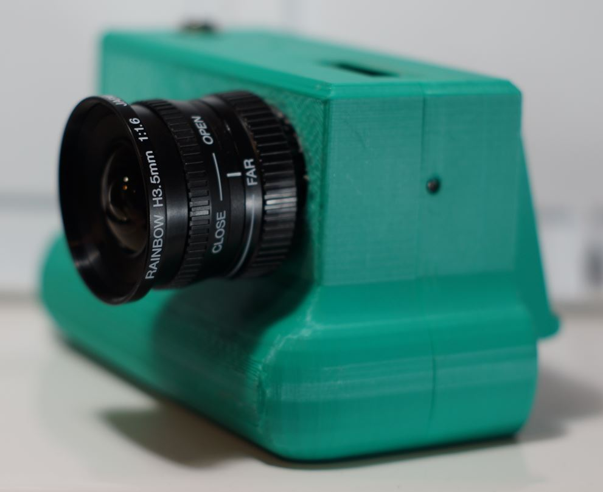
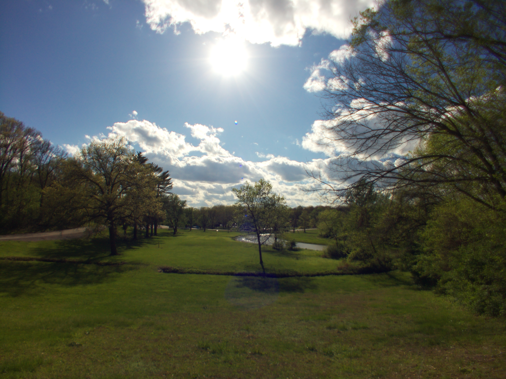

# 3.5mm F1.6 RAINBOW CCTV Lens Fixed Focal Length Iris 1/2" Camera C-Mount H3.51.6

# Impressions

[Close up of lens](https://www.youtube.com/watch?v=FhJdSTl2HSk)

This lens is super wide... almost too wide... definitely for big shots not macro. I tried macro just for kicks and yeah it didn't really work out, on wide open it gives you a neat blur though.

It doesn't help that there are no markings on the lens other than "close/open" and "near/far".

Most of my wide open shots were not in focus unless it was a video.

# Flange adjustment required?

Yes

# Pro

Very wide

# Cons

Low quality, not easy to make sure landscape is in focus

# Sample images

# Outings

## Apr 2026

[Video](https://www.youtube.com/watch?v=HEy777opSUo)
