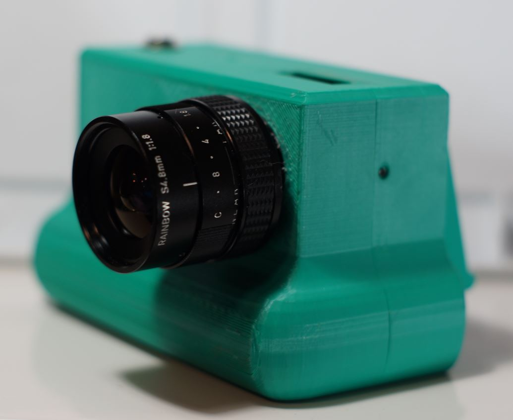
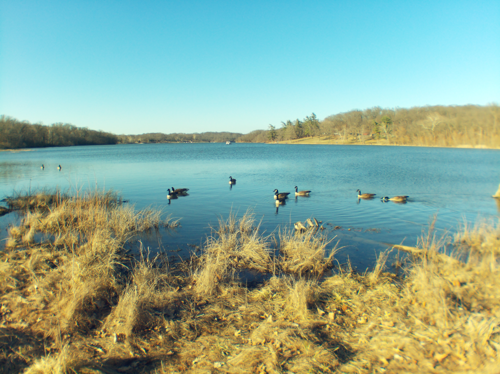
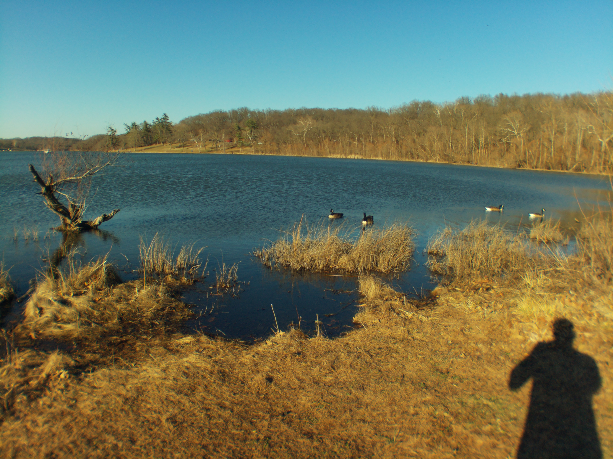

# Rainbow S4.8mm f/1.8 For C-Mount CCTV Lens

# Impressions

[Close up video of lens](https://www.youtube.com/watch?v=FhJdSTl2HSk)

I didn't get much of an impression as when I went out the battery died pretty quickly, that was my bad. It is wide but low quality.

# Flange adjustment required?

Yes

# Pro

Wide

# Cons

Low quality

# Sample images

- normal and macro

# Outings

## Mar 2026

[Video](https://www.youtube.com/watch?v=6hlHeVLLN_8)
