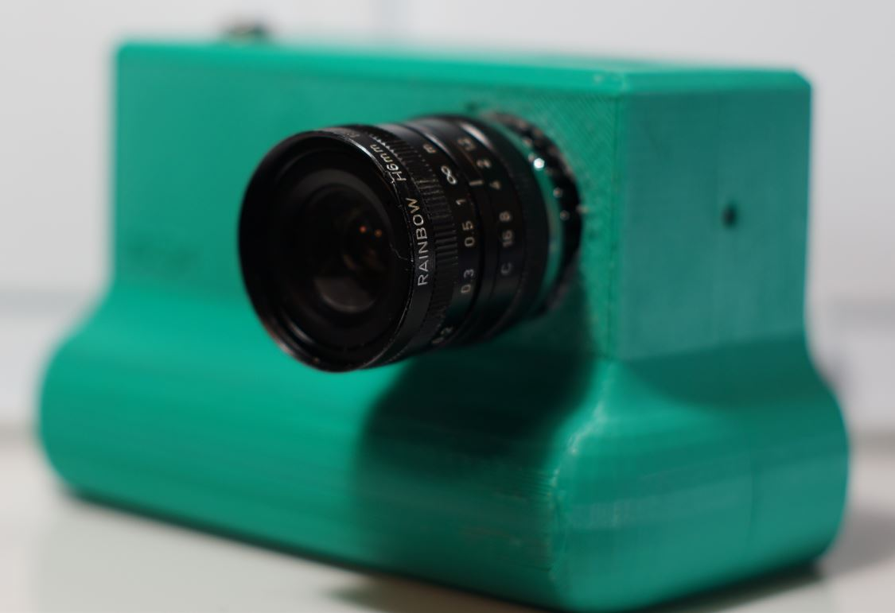
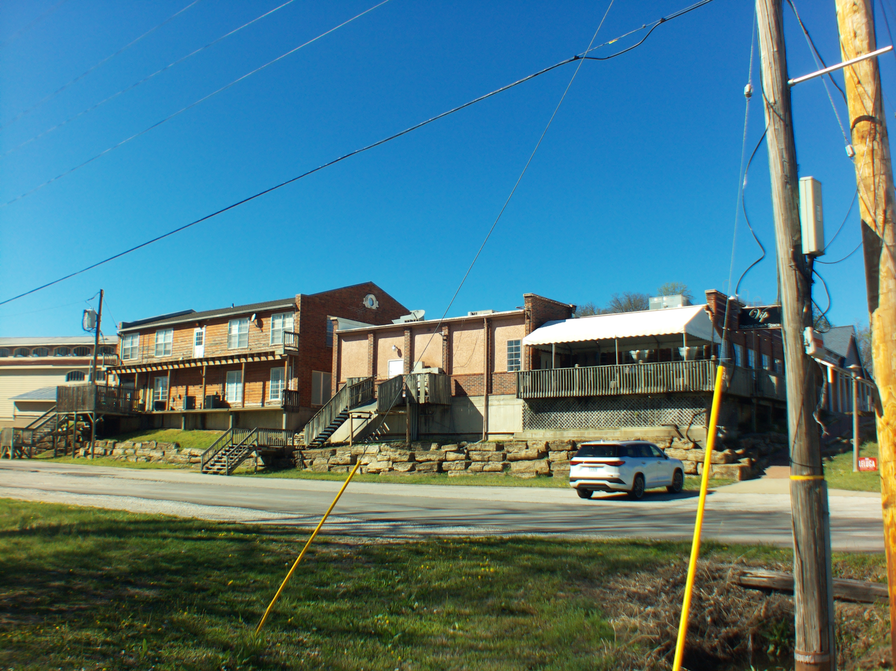
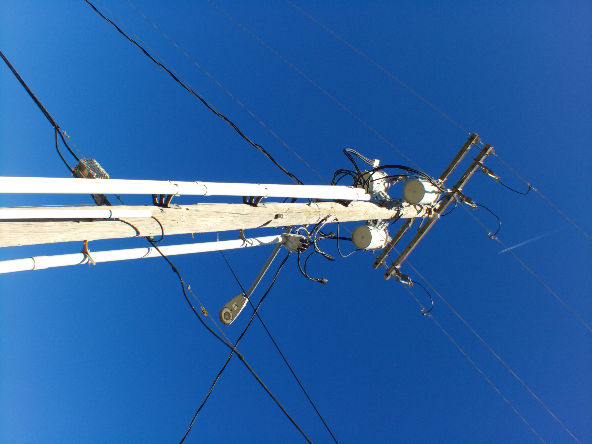
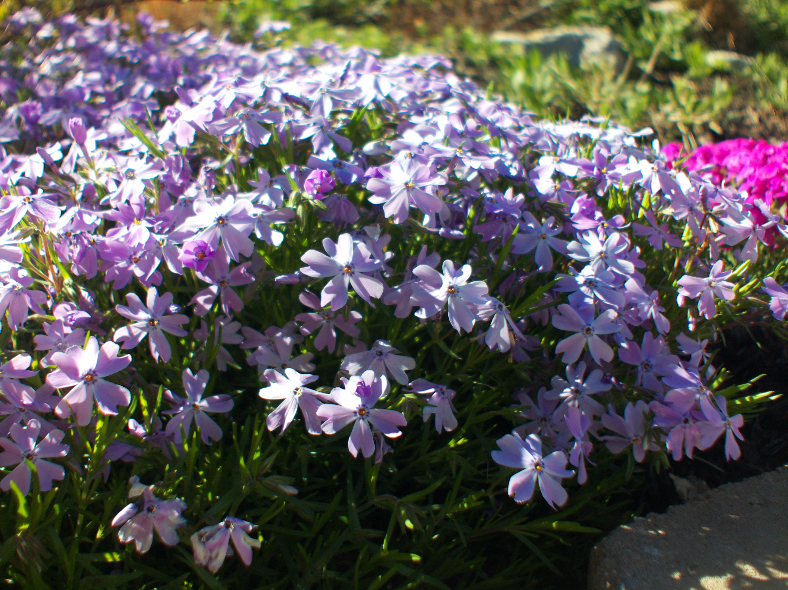

# Rainbow H TV LNES 6mm F:1.2 C Mount

# Impressions

[Close up video of lens](https://www.youtube.com/watch?v=FhJdSTl2HSk)

Physical complaint but using this lens is nasty as it is covered in oil. Also I mention below it's hard to use.

Otherwise it's a pretty decent lens, mid range

# Flange adjustment required?

Yes

# Pro

Wide

# Cons

Hard to use, at least mine is since it doesn't have the nubs to stop the aperture/focus rings from spinning.

# Sample images

# Outings

Apr 2026

[Video](https://www.youtube.com/watch?v=Tc0HY5uABVc)
