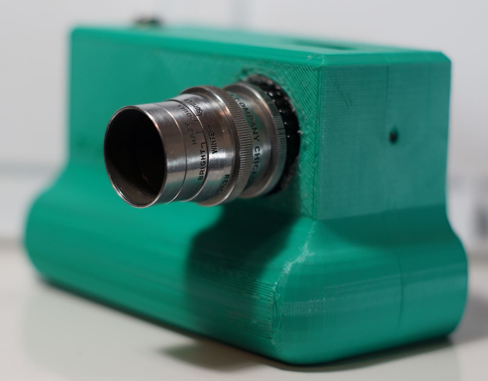
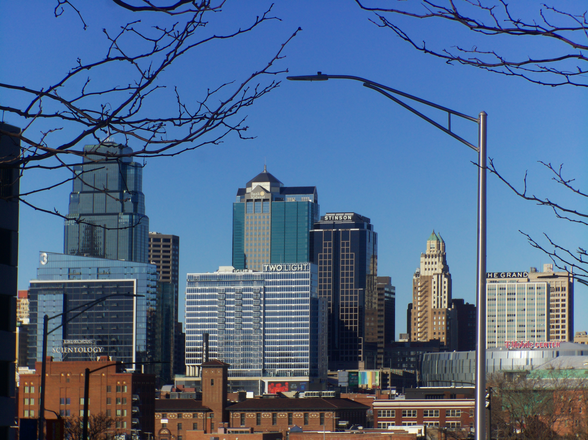
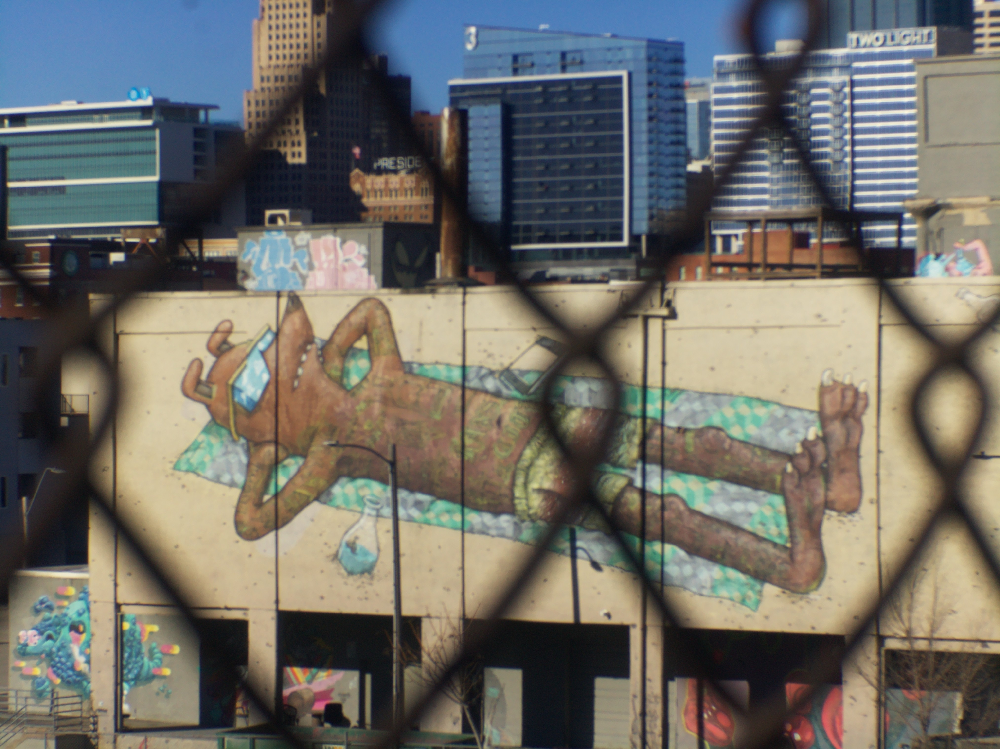
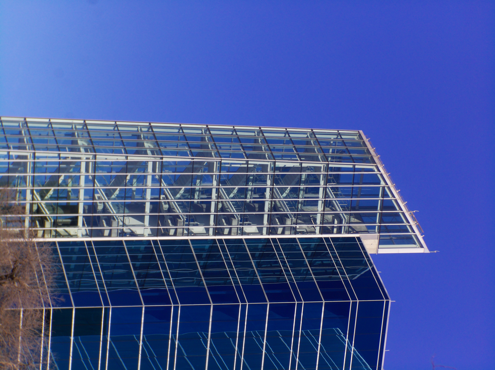

# Revere-Scienar Anastigmat 25mm F 2.5 Vintage Cine Lens C-Mount

# Impressions

[Close up video of lens](https://www.youtube.com/watch?v=Xbj_fDQWka8)

When I first got this lens I was amazed how tiny the lens hole was. This lens is really sharp and works great for photography of buildings.

I had a lot of fun with this lens in the outskirts of the city.

# Flange adjustment required?

Yes

# Pro           

Sharp                                                                                                   
 
# Cons

# Sample images

# Outings

## Feb 2026

POV photography

[Video](https://www.youtube.com/watch?v=Lfut-SsQqaY)

## Jan 2026

Small parks and outskirts of KC

[Video](https://www.youtube.com/watch?v=ThUsWES2a6c)
