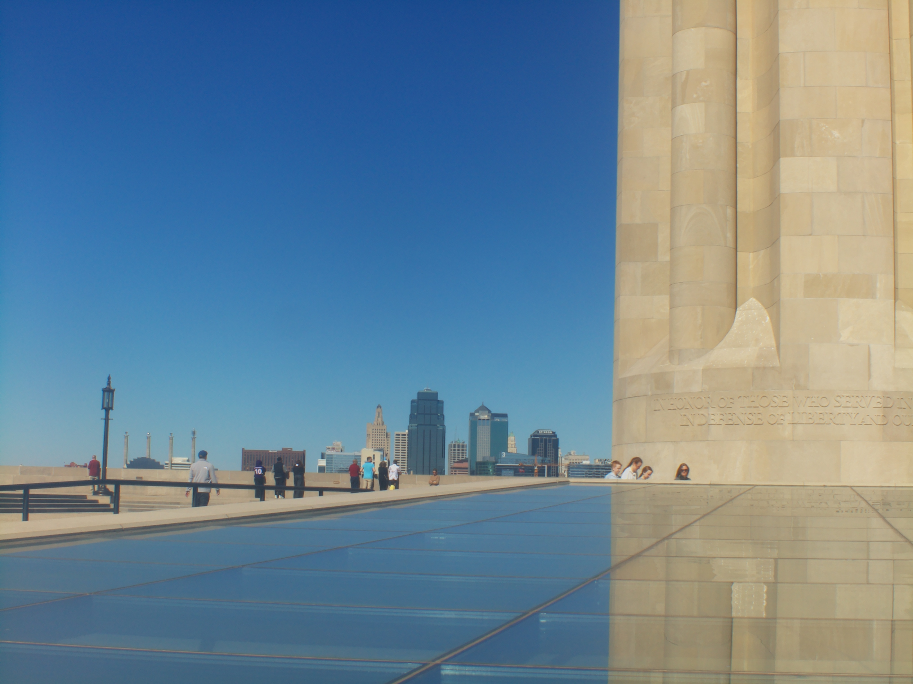
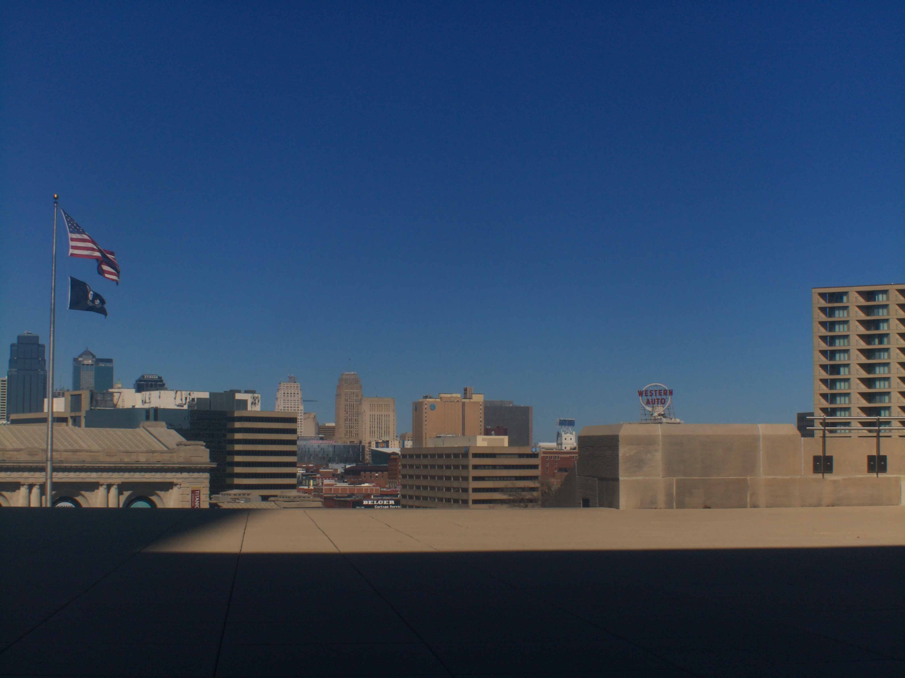
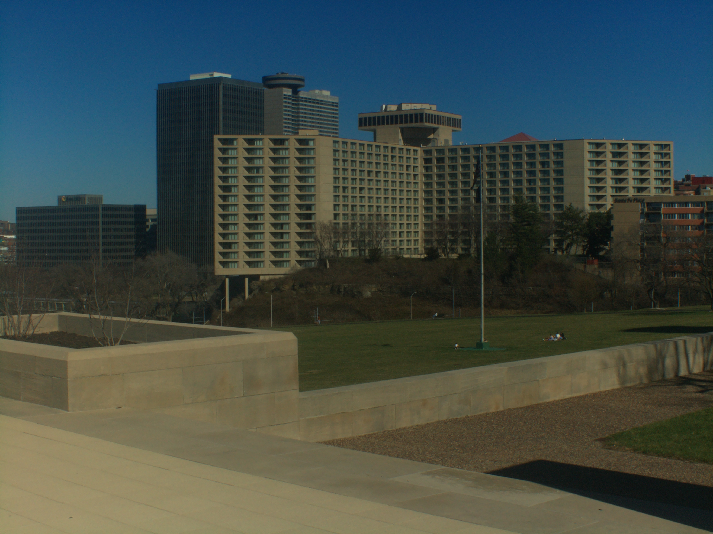

# SOM Berthiot Cinor 10MM H16RX Wide Angle Bolex C-MOUNT LENS

photo of lens

# Impressions

[Close up video of lens](https://www.youtube.com/watch?v=eTo3wx4z86I)

This is another lens I bought as broken (focus ring doesn't spin).

This unfortunately has haze or bloom. Really bad wide open so I shot at a higher aperture.

# Flange adjustment required?

Yes

# Pro

Wide

# Cons

# Sample images

# Outings

## Mar 2026

This was a fun time going out to the Kansas City skyline and liberty memorial tower. Finally something interesting for me to photograph.

[Video](https://www.youtube.com/watch?v=kJCApRBXa9o)
