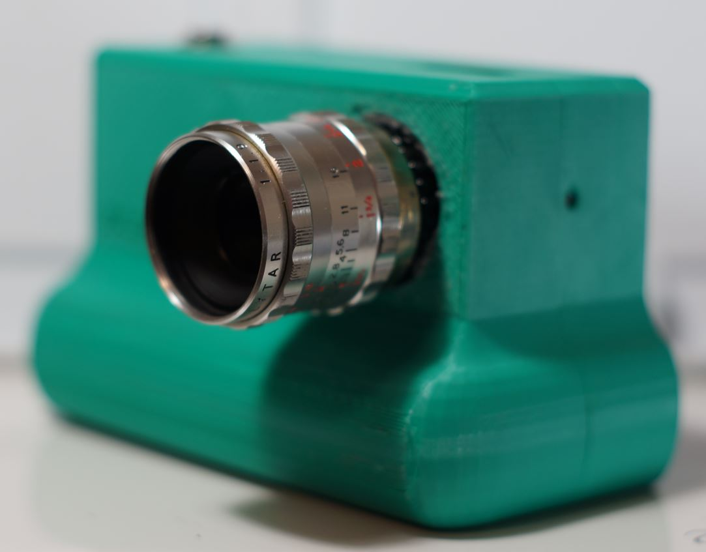
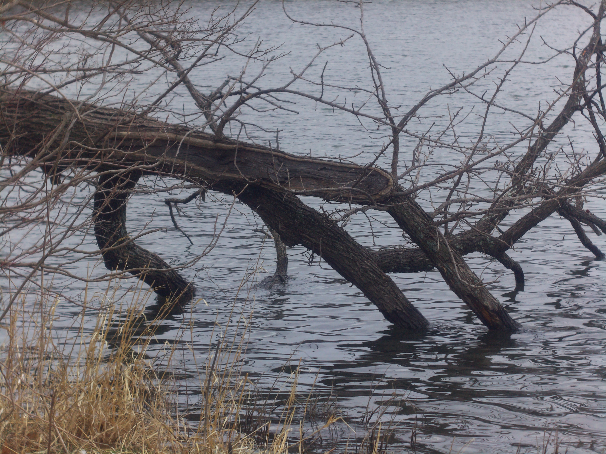
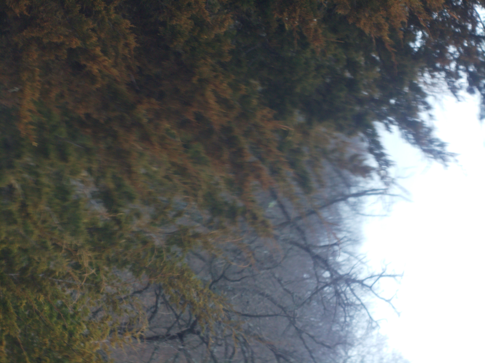
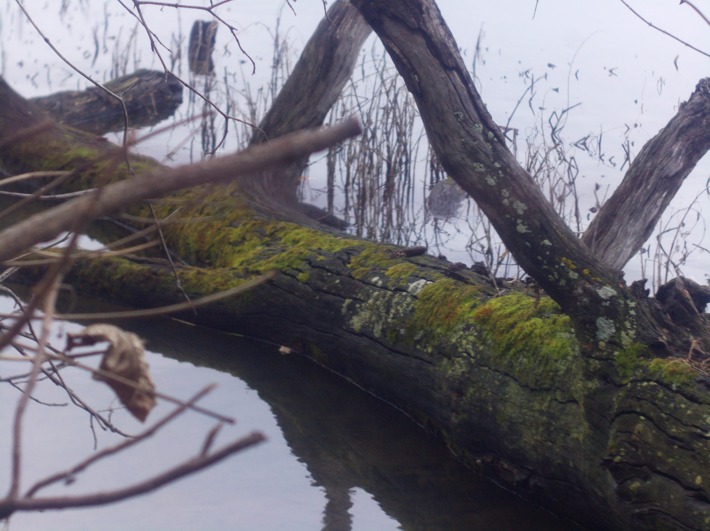

# SOM BERTHIOT LYTAR 25MM C-MOUNT LENS for BOLEX 16MM MOVIE CAMERA

# Impressions

[Close up video of lens](https://www.youtube.com/watch?v=XidLSpXNmhg)

So I got this lens as parts/display, since it had a broken focus ring.

I don't have a good impression of it yet since I haven't used it on a good display yet.

I naively thought I could "just fix it" and I went at it with some pliers... I marked it up dang. I almost made it worse too since the pliers could have scratched the lens.

Anyway I was able to put it back together. This is a lens where flange adjustment is really needed and I'm actually not able to use it on this camera since this camera's flange is not adjustable.

This camera you "adjust the flange" by unscrewing the lens from the CS mount but it has to be unscrewed so far it doesn't safely stay on.

So I have to build another camera where the CS ring can be turned to adjust the flange.

I used the modular pi cam at the time since that one the HQ sensor's CS ring is exposed/not attached to the body like the green camera here.

# Flange adjustment required?

Yes

# Pro

Sharp

# Cons

# Sample images

# Outings

## Mar 2026

[Video](https://www.youtube.com/watch?v=-M9KRiB2LXU)
