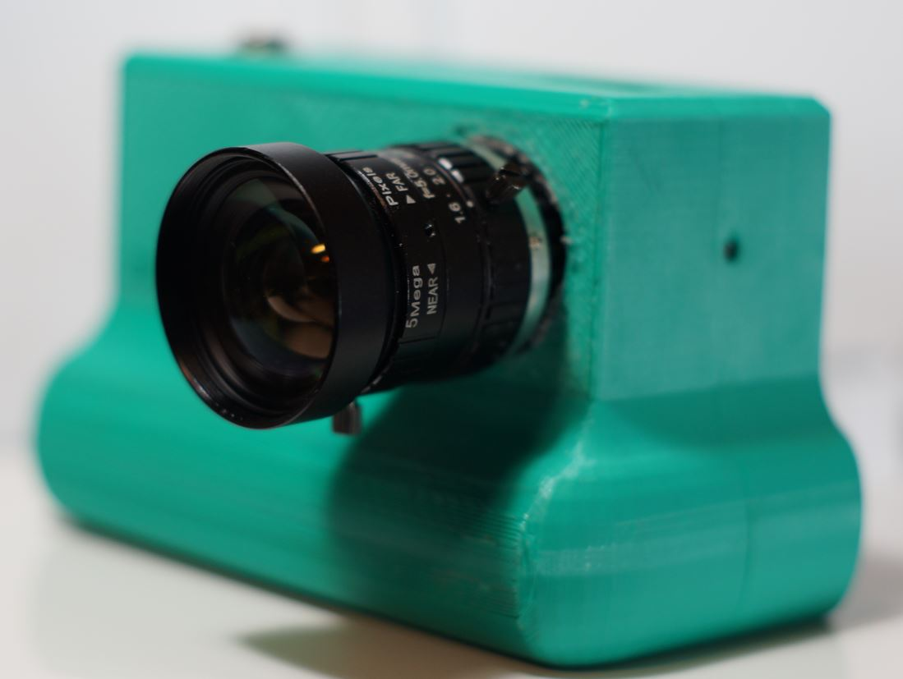

# Sonew 5mm CCTV lens

# Impressions

This is one of the first lenses I bought for the HQ cam before I branched out to other lenses eg. vintage cine lenses.

It's been a while since I took this out so I don't have an impression off other than it being wide/sharp.

# Flange adjustment required?

# Pro

Wide

# Cons

# Sample images

- normal and macro

# Outings

- descending date, sample pic, notes
