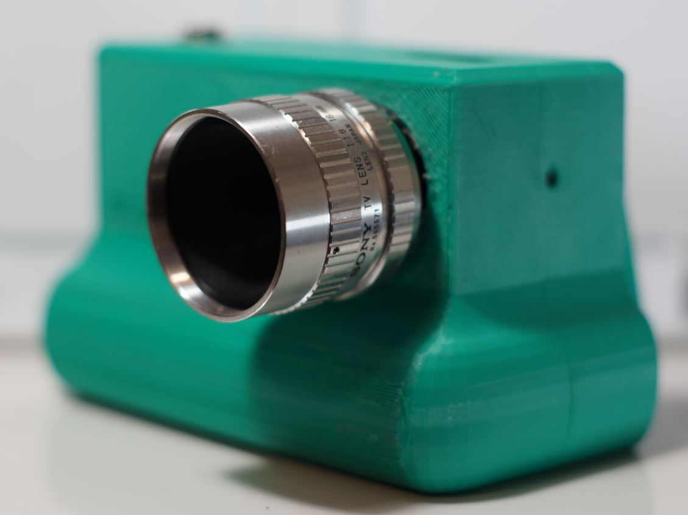
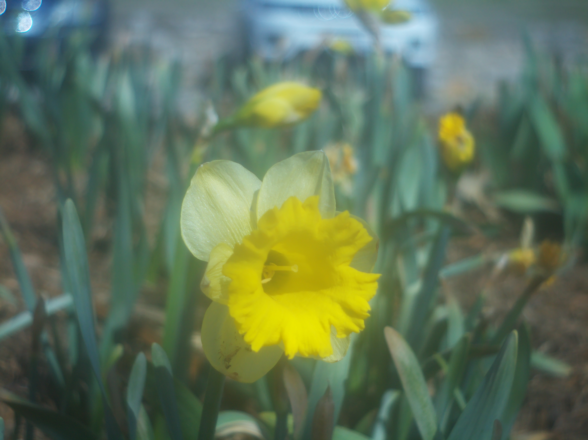
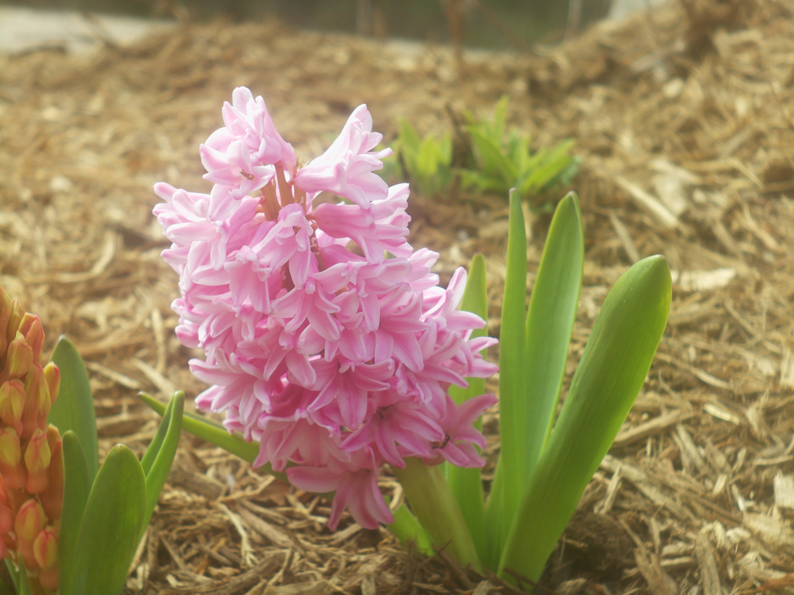

# SONY COSMICAR F 1.8 16mm C-MOUNT LENS CCTV

# Impressions

[Close up video of lens](https://www.youtube.com/shorts/tB79da5AR68)

Unfortunately this lens has really bad haze. I didn't realize it when I bought it since the eBay listing had it against a white background.

I think it is actually sharp though if you look at the bell pepper photo below.

# Flange adjustment required?

Yes

# Pro

# Cons

# Sample images

# Outings

## Mar 2026

[Video](https://www.youtube.com/watch?v=nlgTmQjK-V4)
