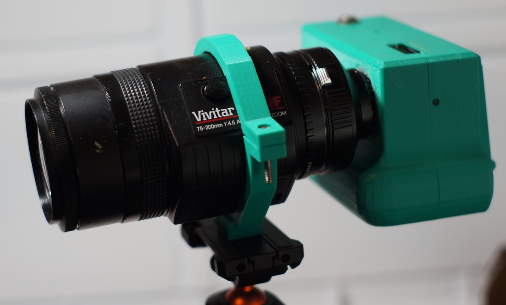
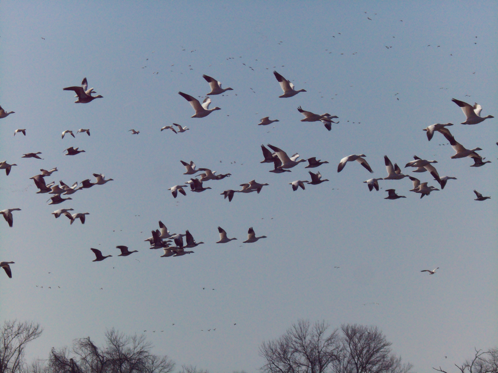
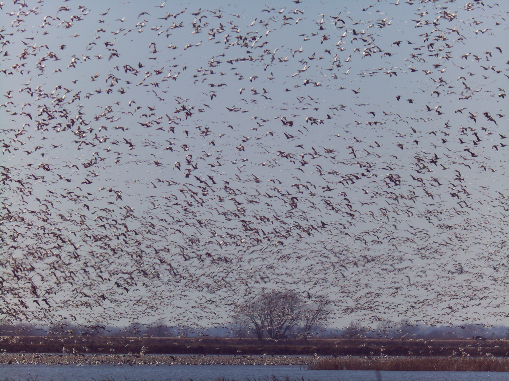

# Vivitar Auto Focus Lens 75-200mm f/4.5 For Nikon AF-Mount

# Impressions

I've had a lot of fun with this lens and it's only $35. I am using it purely in manual mode, no batteries in it. You need a Nikon F to C-mount adapter which I have a Fotasy adapter.

What I like about this lens is it focuses across the entire focal range. You don't have to unscrew it from the C-CS adapter on the Raspberry Pi HQ cam either. A lot of lenses I've been trying eg. cine vintage lenses, have to be unscrewed about a milimieter to focus 15-30 ft away.

**Affiliate link for lens adapter**

[amazon](https://amzn.to/402hO28)

# Flange adjustment required?

No

# Pro

Cheap and fun

# Cons

Purple tinting if looking into the sun. ND filter doesn't seem to fix it.

# Sample images

- normal and macro

# Outings

## Feb 2026

Snow geese

[Video](https://www.youtube.com/watch?v=1GjfKuYk2jw)

## Jan 2026

Took it out again this time with snow and snow geese birds at my local lake

Not as many as Loess Bluffs above

[Video](https://www.youtube.com/watch?v=pYun7PNlq8k)

First time I took it out, no tripod

[Video](https://www.youtube.com/watch?v=6mGU9Qj4sWQ)
